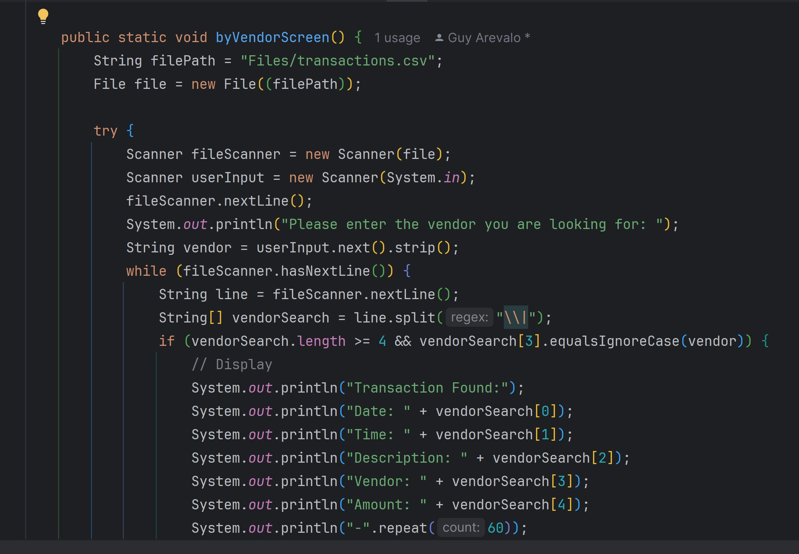

# Accounting-Ledger-Application
A capstone project that tracks all financial transactions for business or personal use.

4-29-24
Started out with first drawing out the screens I would need(see picture below).

Once starting on the project I started setting up for the "Home Screen" first. I would set up all in the 
"ScreenPage.java". Once I finished getting all the screens working for the "homeScreen" I would setup another class
to space out the other screens I would need which was for the "Ledger" and the "Reports" screens. Since I already did the work for the home screen,
I copy and pasted the code from the "homeScreen" to setup "ledgerScreen" and "reportsScreen" More easily. Did have a issue with the user input being asked twice ,but was resolved by leaving it as "int choices = userinput.nextint()". Not sure if the best way to do it ,but works perfectly in the time of writing.

update 4-30-24
Home screen options all work as intended. Deposit and payment options will input correctly into the "transaction.csv" file. Once I got the deposit working I just copied and pasted the functions of that into the payment since it was the same thing ,but changed the text of what it would ask the user along with making sure it displayed it as a negative when it was a payment. 
deposit and payment screens below:

Currently still working on making all of the ledger options are working. So far only being to view all info is the only thing working.
Did move some things out of the "ScreenPages.java" class for the moment just because it felt cluttered.
known bugs or errors: N/A

5-1-24 update
Ledger and home screen both work now. Ledger now displays All info, Just the deposits and just the payments. Had to fix little minor issues because I didn't realize it was having errors because of it trying to display the header in the csv file. Luckily that's been resolved.Finished the last of the screens. Updated the depsoit and payment screens so that time would be formatted as HH:mm:ss because it made everything look werid on the other screens when display anything in the csv file.
This is how I did my monthToDateScreen along with yearToDateScreen. Used the same code more or less with both. Diffrence just setting it so one looked for month and the other is year.
Month to date photos below:

Year to date photos below

The vendor screen which asks the user for the vendor and finds all transactions in the csv that matches the vendors name, was the most challengeing to do. The other screens were just printing things that the user wanted to see while this needed the user to actually input something into it. At the time of writing, I was struggling alot on how to the file reader to search for what was inputted and then print it out.
vendor screen below:

known bugs or errors: N/A